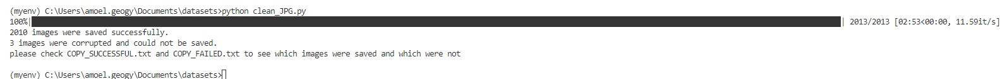
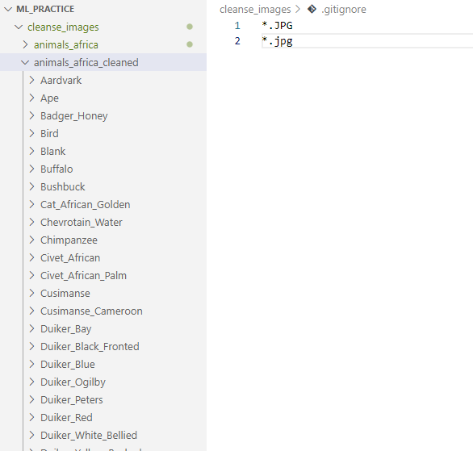
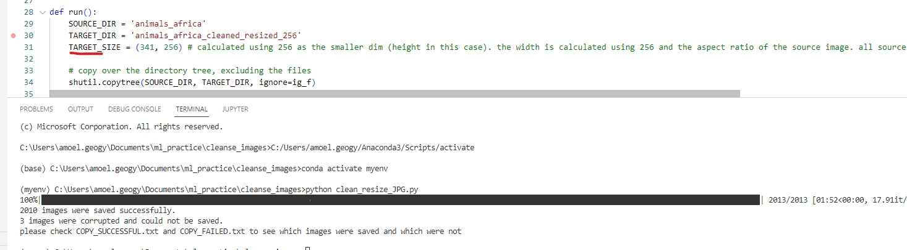

## clean JPG images

Create a function that copies over a folder (preserving the folder hierachy) with all its images, saving each image using PIL. 
This will get rid of all corrupt images (corrupt images might cause a model training session to crash in the middle of training).
The images after they're saved by PIL will also be smaller in size
 

 

#### directory structure example (git does not add empty folders. images were excluded with the gitignore)
 

#### clean_resize_JPG.py
added the functionality to also resize images. 
 