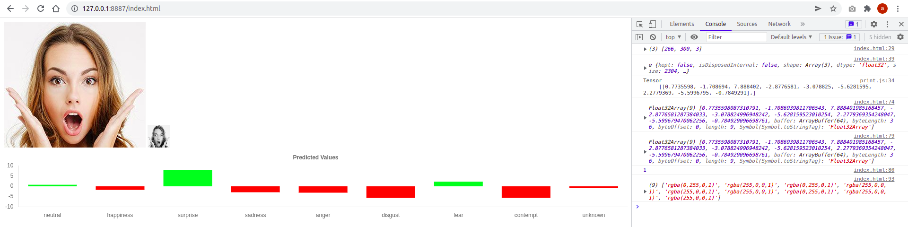
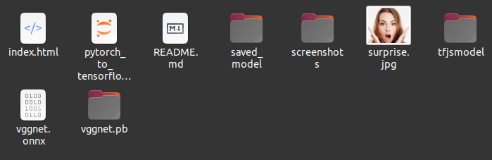
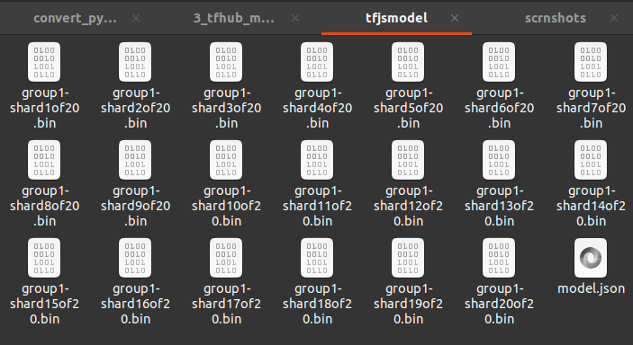

## screenshots

the pytorch model was converted to onnx, to tensorflow and finally to a tensorflowjs graph model. this model was then used in index.html to predict the expression of the face.  

  

  
note: in the image above, the saved_model folder is not the tensorflow saved model. it is the folder (which i created), in which the pytorch model is saved. the tensorflow savedmodel is vggnet.pb. and the onnx saved model is vggnet.onnx, and the tfjs saved model is in the tfjsmodel folder

  
tfjs model is saved like this, in shards.

### tfjs code to load the model index.html
tf.ready().then(() => {  
            const modelpath = 'tfjsmodel/model.json';  
            tf.tidy(() => {  
                    tf.loadGraphModel(modelpath).then((model) => {  