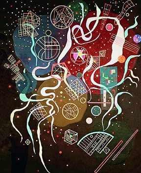
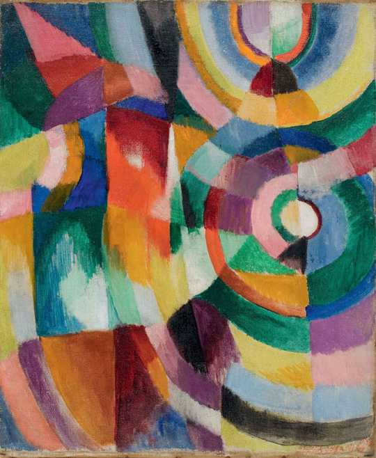

## screenshots

### test 1
   
    
    

### test 2. without lr. initial lr = 0.001
   
    
    

### test 3 with lr. initial lr = 0.005. after training for half the number of epochs, lr is decreased to 0.025
    
    