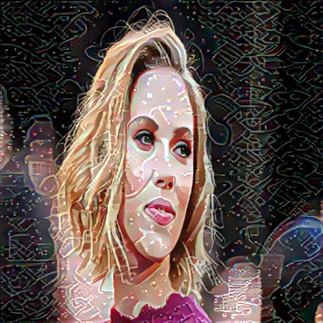

## screenshots

### test 1
   

   
  
  
  
  

   
  
  
  
  

### test 2. without lr scheduler. initial lr = 0.001
   

   
  
  
  
  

   
  
  
  
  

### test 3 with lr scheduler. initial lr = 0.005. after training for half the number of epochs, lr is decreased to 0.025

   
  
  
  
  

   
  
  
  
  

### compare
### last 5 images without lr scheduler

   
  
  
  
  

### last 5 images with lr scheduler

   
  
  
  
  

