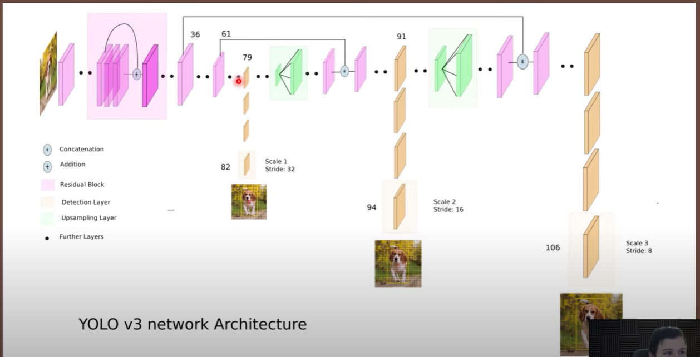

## YOLOv3

[paper](https://arxiv.org/abs/1804.02767)   
[youtube link](https://www.youtube.com/watch?v=Grir6TZbc1M&t=1987s) 
[github](https://github.com/aladdinpersson/Machine-Learning-Collection/tree/master/ML/Pytorch/object_detection/YOLOv3)  

#### architecture
