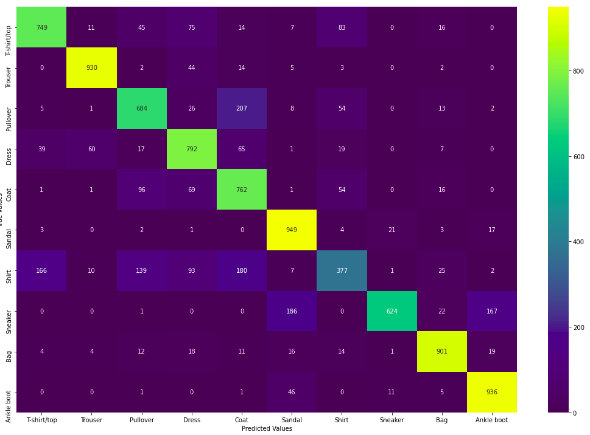
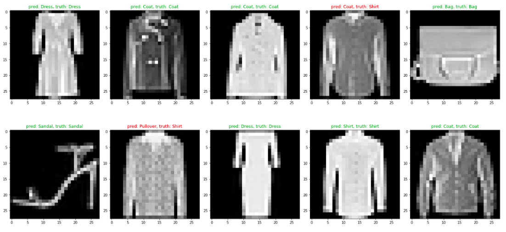

## screenshots

In this notebook, we trained a model to take in an image and classify it among the following labels:
 ['T-shirt/top','Trouser','Pullover','Dress','Coat','Sandal','Shirt','Sneaker','Bag','Ankle boot']

### confusion matrix
  

### test the results
  
