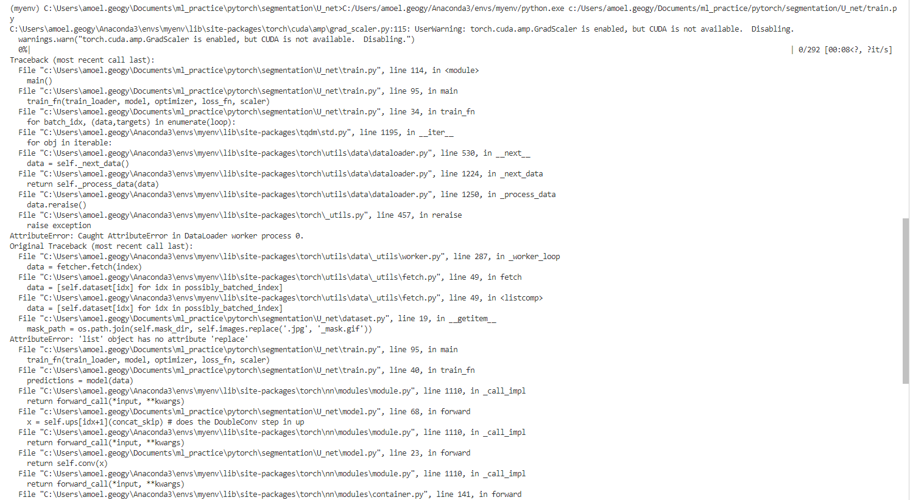
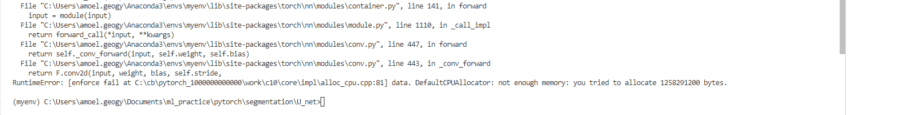

## U net

there is a difference between this implementation and the implementation in the paper. our model uses padded convolutions, while the paper uses valid convolutions.
the dataloading part will be much more difficult if we use valid convolutions. the dataset was taken from the carvana kaggle competition. the winners of this competition used 
same convolution. so we can say that we're not losing too much performance by using a same convolution instead of a valid convolution 

[youtube link](https://www.youtube.com/watch?v=IHq1t7NxS8k) 
[paper](https://arxiv.org/abs/1505.04597) 
[github link](https://github.com/aladdinpersson/Machine-Learning-Collection/tree/master/ML/Pytorch/image_segmentation/semantic_segmentation_unet) 
[dataset](https://www.kaggle.com/competitions/carvana-image-masking-challenge/data)  

NOTE: for the validation dataset, i cut-pasted some images and masks from the train dataset.  

### train.py runs, but fails due to lack of memory and because cuda is not present
 
 
